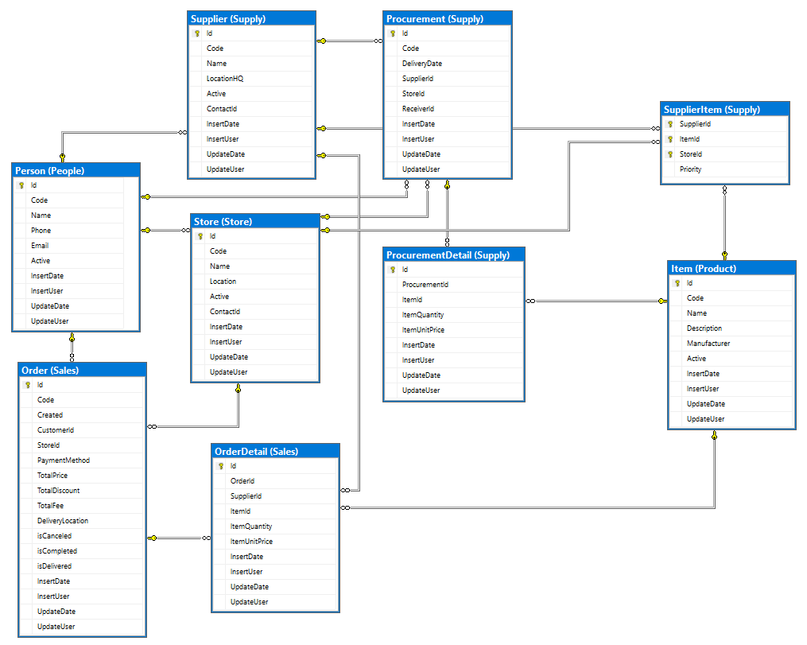

# Retail Procurement System

This project is a comprehensive .NET 7 Web API designed to facilitate retail procurement processes. 
It includes a RESTful API for managing store items, handling suppliers, and offering statistics. 
The aim of this assignment is to showcase expertise in API development, database design using Entity Framework Core, automated testing, Dockerization, and optional SignalR implementation or Angular integration. 
Additionally, it emphasizes the implementation of software patterns for better code organization and maintainability.

## Specific nugget packages used in project
- MediatR
- FluentValidation
- EntityFrameworkCore
- Bogus
- AutoMapper
- Newtonsoft.Json
- xUnit
- AutoFixture
- FluentAssertions
- Moq

## TODO
Besause of lack of time next systems waiting for implementation are:
- Authentification
- SignalR
- Docker Optimization
- Separate BL

## Project Structure

### SimpleRetail.API
- API endpoints are implemented for managing store items, suppliers, statistics, and supplier-store item relationships.
- Business logic and validation is implemented to handle procurement processes, statistics generation, and interaction with the database.

### SimpleRetail.Common
- DTOs (Data Transfer Objects) are created to transfer data between the API and the client (responses).
- Multilingualism is solved on this layer.
- Global Error Handling is solved on this layer.

### SimpleRetail.Data
- The database context, models, and migrations are achieved using Entity Framework Core.
- Seeding the database with initial values is achieved using library Bogus for generating data.

### SimpleRetail.Tests
- Automated tests are created to ensure the reliability of the application. Unit Tests are Utilize with framework xUnit.

### Swagger
Swagger is used to demonstrate usage and for documentation of APIs.

### TODO: SignalR Hub or Angular Integration
Implement SignalR Hub for real-time communication or integrate Angular for frontend development.


## Database Design




## Build, Run, and Test Instructions

### Prerequisites
- .NET 7 SDK installed
- Docker (optional, for Dockerization)

### Database Migration and Update
Start with setting up Connection String to you database server in <em>appSettings.json</em>.
After that, to apply database migrations and update the database schema, run the following commands:
```
dotnet ef migrations add InitialMigration
dotnet ef database update
```

### Build the Application
```
bash
dotnet build
```

### Run the Application
```
dotnet run --project SimpleRetail.API
```

### Test the Application
```
dotnet test
```


## Note
This project serves as an opportunity to demonstrate proficiency in various aspects of .NET Core development, including API design, database management, testing, and software patterns.
Feel free to reach out if you have any questions or need clarification on any aspect of the assignment.